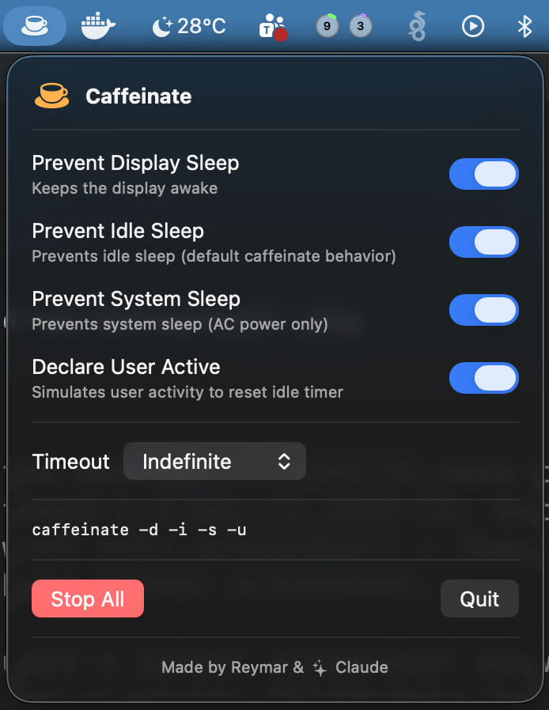

# Caffeinate UI

A native macOS menu bar app that provides a GUI for the [`caffeinate`](https://ss64.com/mac/caffeinate.html) command.



## Features

- **Toggle flags** — Enable/disable caffeinate flags individually:
  - `-d` Prevent display sleep
  - `-i` Prevent idle sleep
  - `-s` Prevent system sleep
  - `-u` Declare user active
- **Enable All** — Master toggle to enable/disable all flags at once
- **Persistent state** — Toggles and timeout settings are remembered across app launches
- **Launch at Login** — Option to start the app automatically at login via SMAppService
- **Timeout picker** — Preset durations (15m, 30m, 1h, 2h), custom h:m:s input, or indefinite
- **Live countdown** — Shows remaining time next to the timeout picker
- **Command display** — Shows the exact `caffeinate` command being run
- **Reactive icon** — Menu bar icon changes from outline to filled when active
- **Single instance** — Only one instance can run at a time (POSIX file lock)
- **Clean startup** — Kills any stale caffeinate processes from previous sessions
- **Graceful cleanup** — Terminates caffeinate when the app quits

## Requirements

- macOS 14+ (Sonoma)
- Swift 5.10+

## Build & Run

**Development:**

```sh
swift build && swift run CaffeinateUI
```

**Test:**

```sh
swift test
```

**Release + install:**

```sh
./build.sh
```

Builds a release `.app` bundle with `LSUIElement = true` (no Dock icon) and installs it to `/Applications/Caffeinate UI.app`.

## Architecture

Built with SwiftUI and SPM — no Xcode project needed.

```
Sources/
├── CaffeinateUI/                       # CaffeinateCore library target
│   ├── CaffeinateUIApp.swift           # App struct, MenuBarExtra scene
│   ├── Models/
│   │   ├── CaffeinateFlag.swift        # Enum: -d, -i, -s, -u
│   │   └── TimeoutOption.swift         # Enum: presets + custom + indefinite
│   ├── Services/
│   │   ├── CaffeinateService.swift     # Protocol + impl: spawns/kills caffeinate
│   │   └── UserDefaultsProtocol.swift  # Protocol for testable UserDefaults access
│   ├── ViewModels/
│   │   └── CaffeinateViewModel.swift   # @Observable state management
│   └── Views/
│       ├── CaffeinatePanel.swift       # Root popover view
│       ├── FlagToggleRow.swift         # Toggle row with label + description
│       ├── TimeoutPicker.swift         # Duration picker with h:m:s fields
│       └── TimerDisplay.swift          # Countdown display + formatDuration()
└── CaffeinateUIMain/
    └── main.swift                      # Thin executable entry point

Tests/CaffeinateUITests/
├── CaffeinateFlagTests.swift
├── CaffeinateViewModelTests.swift
├── PersistenceTests.swift
├── TestHelpers.swift
├── TimeFormattingTests.swift
└── TimeoutOptionTests.swift
```

## Made by

Reymar & Claude
